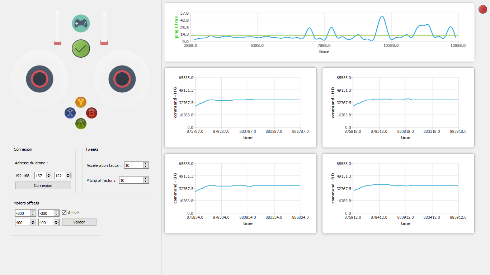

# Drone
Controlling a drone with Qt. Real time view of each motor's speed with QCharts

Receiver : https://github.com/EViallet/Drone_Receiver

# Working
* Gamepad controlling speed, tweakable at runtime (for live testing)
* Real time plotting of speed and ping

# TODO
* Infrared sonar for altitude
